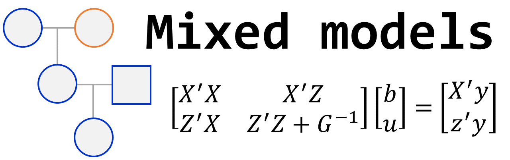



## Cross prediction and optimization

### Motivation  

{:width="40%" align="right"}

Plant breeding programs rely on balancing long-term genetic diversity and genetic gains, which are conflicting goals. Therefore, in the short term, plant breeding programs with genomic selection can improve performance by selecting individuals with the most outstanding genetic values for composing the next generation. Unfortunately, GS also accelerates the decrease of genetic diversity through cycles of selection. A method to deal with this corollary is cross selection, where we can jointly optimize the selection of crosses and the maintenance of genetic diversity. The combination of those factors (increasing the trait means and reducing inbreeding/coancestry) represents an important tool for selecting the best parents for the next generation.

- **Main topics:**

   - **Usefulness prediction**  
   - **Cross prediction**  
   - **Non-additive effects**  
   - **Cross optimization**
   - **Package development**

### SimpleMating

As part of this topic, we created an R package for cross-optimization. SimpleMating can be downloaded from [here](https://github.com/Resende-Lab/SimpleMating). Check out the [paper](https://doi.org/10.1002/tpg2.20533)

***

## Breeding Design

### Motivation
{:width="30%" align="right"}

Breeding programs are intricate and multifaceted systems that demand careful consideration when implementing tools and refining resource allocation. Breeding design via breeding program simulation has emerged as a valuable approach for assessing and fine-tuning various aspects of these programs. Breeding program simulations serves as an ideal platform for evaluating the overarching strategy and the intricate details. This includes aspects like selection methods, program sizes, the number of testers, the integration of genomic selection tools, and the optimal number of environments to be included.

- **Main topics:**
  - **Decision-based breeding**  
  - **Genomic selection implementation**
  - **Parental selection and allocation**  
 
***

## Mixed models methodology

### Motivation
{:width="30%" align="right"}

Mixed models methodology has become a standard tool for evaluating data in breeding programs, offering numerous advantages that motivate researchers to embrace them as a powerful tool in plant breeding. These models enhance genetic-statistical analyses, increase the accuracy of selection, provide a better understanding of trait architectures, and facilitate the implementation of genomic selection in breeding programs. These benefits serve as strong motivation for researchers to embrace mixed models and harness their power in breeding programs.

- **Mainly topics:**
  - **Variance components estimations**  
  - **Modelling**  
  - **Genomic selection**  
  - **Models with additive and non-additive effects**  
  - **BLUEs and BLUPs**  

***

## Markers panel imputation 

### Motivation  

{:width="30%" align="right"}

The implementation of Whole Genomic Selection has been proven as an important tool for increasing genetic gain in several breeding programs. However, the acquisition of such high-density covered markers represents a barrier to the implementation of WGS in breeding programs. One alternative is to input some markers rather than measure them directly, which could decrease the costs of WGS.

- **Objective**  
  - Evaluate the predictive ability of genomic values for some target traits in Sweet Corn when genotypes at some SNPs loci were imputed rather than measured directly.     

***

## Genotype-by-environment interaction in potato breeding program

### Motivation  

{:width="30%" align="right"}

Large planted crops faces the

- **Objective**  
  - To recommend potato varietys for target population of environments.

***

 

