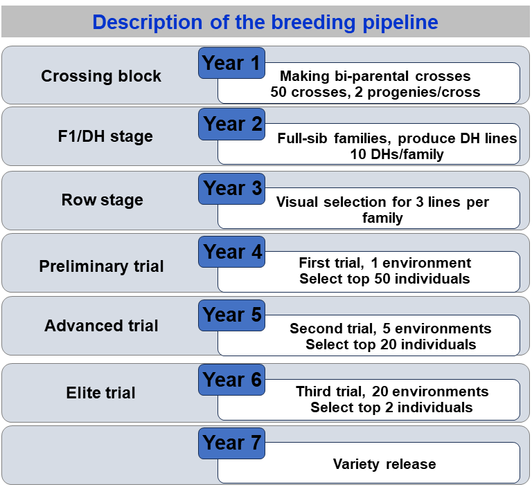

```{=html}
<style type="text/css">
  body{
  font-size: 12pt;
}
</style>
```

## Introduction

As we recall from the first vignette, in a way to implement a set of simulations in the **AlphaSimR** package four steps must be followed:

1. Simulate founder genomes/haplotypes.
2. Set global simulation parameters for a target trait/traits.
3. Model the breeding program.
4. Examine results by looking into population individuals' metrics.

In this vignette, we will cover a few useful functions from **AlphaSimR** that will help to Model the breeding program (step 3). In addition, we will compare two implementations over a few generations of selection.


We will start by loading the packages.


```{r}
rm(list=ls())
# Loading packages
library(AlphaSimR)
library(ggplot2)

```

## Modeling a breeding program in **AlphaSimR**

Introducing a pipeline:



### Founder Genome

Let's start the simulation by creating the base genome.

```{r, eval=FALSE}
# Creating the founding genome
founderGenomes = runMacs(nInd = 100,
                         nChr = 4,
                         segSites = 100,
                         species = "MAIZE")


# Setting up trait characteristics
SP = SimParam$new(founderGenomes)
SP$addTraitA(nQtlPerChr = 100, 
             mean = 10, 
             var = 1)

# Generating base population
Parents = newPop(founderGenomes)


```

### Making crosses

First, at the beginning of each breeding cycle, we generate new crosses. We can implement random crosses as well as make oriented crosses by giving the list of crosses to make.

```{r, eval=FALSE}

# 1. Crossing randomly
F1pop = randCross(pop = Parents, nCrosses = 100, nProgeny = 2)
F1pop@mother

# 2. Make crosses by a list of individuals
# Making the crossing plan
MatingPlan = data.frame(Parent1 = Parents@id[1:5],
                        Parent2 = Parents@id[6:10])
# Crossing based on the crossing list
F1Pop = makeCross(Parents, crossPlan = as.matrix(MatingPlan))

# Checking out the pedigree records out of F1
Pedigree = data.frame(Ind = F1Pop@id,
                 Parent1 = F1Pop@mother,
                 Parent2 = F1Pop@father)

```

### Advance the genotypes

Now, we can advance the materials. One function that we may use is the `self()`.

```{r, eval=FALSE}
  # Advancing F1->F2
  F2pop = self(pop = F1pop, nProgeny = 10)


F2pop@
``` 

Then, we may assume phenotypes for all those individuals. For each individual, the phenotypes are assumed to come from the genetic values generated. Then, **AlphaSimR** adds in each genetic value a random error sampled from a multivariate normal distribution in the function `setPheno()`. Some important arguments in the function `setPheno()` are:

**pop** = the target population with the individuals to assume the phenotypes.  
**h2** = narrow-sense heritability.  
**H2** = broad-sense heritability.  
**varE** = residual variance.  
**reps** = number of repetitions.  
**p** = the p-value for the environmental covariate used by GxE traits. If NULL, a value is sampled at random.  


There are three options for assuming the error variance mentioned. We can set the argument *h2*, *H2*, *varE*. We should use only one of these arguments. If we supply values for more than one, only one will be used according to the order in which they are listed above.

```{r, eval=FALSE}
# Explanation taken from Bancic et al. (2024)

# ---- Setup simulation ----
# Create founder haplotypes
founderGenomes = quickHaplo(nInd = 1000,
                        nChr = 1,
                        segSites = 1000)

# Set simulation parameters
SP = SimParam$new(founderGenomes)

# Add an additve + dominance trait
SP$addTraitAD(
  nQtlPerChr = 1000,
  mean   = 0,
  var    = 1,
  meanDD = 0.92,
  varDD  = 0.2
)

# Create population
pop = newPop(founderGenomes)

# Obtain true additive and total genetic variance from SP object
# These relate to the founder population and will change with selection
varA = SP$varA[1]
varG = SP$varG[1]

# NOTES:
# Users should choose only one of three options to set phenotype.
# Option 1 and 2 use variances that relate to the founder population

# Trait heritability equals to 0.5.

# ---- Option 1: By assigning the narrow sense heritability ----

pop = setPheno(pop, h2 = 0.5)
pop@pheno[1:10]

# Check heritability
cor(pop@pheno, pop@gv)^2
```


```{r, eval=FALSE}
# H2 or h2

# 
#             varA                 1
# h2 = ------------------- = ------------- = ~ 0.5
#       varG + varE/nreps       1.52 + 0.47/1
#

# Equivalent to manual setting of phenotype as
varE  = varA / 0.5 - varG  # obtain error variance given h2 and varA
error = rnorm(pop@nInd, sd = sqrt(varE))
pheno = pop@gv + error

# Check heritability
cor(pheno, pop@gv)^2

# ---- Option 2: By assigning the broad-sense heritability ----

pop = setPheno(pop, H2 = 0.5)

# Check heritability
cor(pop@pheno, pop@gv)^2

# Equivalent to manual setting of phenotype as
varE  = varG / 0.5 - varG  # obtain error variance given h2 and varG
error = rnorm(pop@nInd, sd = sqrt(varE))
pheno = pop@gv + error
# Check heritability
cor(pheno, pop@gv)^2

# ---- Option 3: By assigning error variance and number of replications ----

pop = setPheno(pop, varE = 1, reps = 1)
# Check heritability
cor(pop@pheno, pop@gv)^2

# Increasing the number of replications will result in higher h2
pop = setPheno(pop, varE = 1, reps = 10)
# Check heritability
cor(pop@pheno, pop@gv)^2

# Equivalent to manual setting of phenotype as
reps  = 10
varE  = 1
error = rnorm(pop@nInd, sd = sqrt(varE))
pheno = pop@gv + error / sqrt(reps)
# Check heritability
cor(pheno, pop@gv)^2

```

The *reps* argument is for convenient representation of replicated data. It is intended to represent replicated yield trials in plant breeding programs. In this case, *varE* is set to the plot error and *reps* is set to the number of plots per entry. The resulting phenotype represents the entry-means.

Another argument in the `setPheno()` function is *p*. It represents the environmental covariate and it varies from 0-1. Values close to 0 and 1 put more weight on the phenotypic values (larger errors) and values close to 0.5, have a smaller weight (lower errors). Generally, we assume uniform values for the *p* argument.

We will explore more in the following populations:

```{r, eval=FALSE}
# Setting phenotypes
F2_pop1 = setPheno(F2pop, reps = 2, h2 = 0.1, p = 0.1) 

# Setting phenotypes
F2_pop2 = setPheno(F2pop, reps = 2, h2 = 0.1, p = 0.5) 


# Correlation of the phenotypes with the genetic values
cor(F2_pop1@gv, F2_pop1@pheno)^2
cor(F2_pop2@gv, F2_pop2@pheno)^2


```

The next step in modeling the breeding program is to make selections on the phenotypes. We may use the function *selectInd()*

```{r, eval=FALSE}
# Setting phenotypes
F2pop = setPheno(F2pop, varE = 10, reps = 1)

# Select the best-performing individuals according to their phenotype
F2popSel = selectInd(pop = F2pop,
                            nInd = 20,
                            use = "pheno") # gv, pheno, bv, ebv

```


Then, we can advance the materials and do selections to the end of the pipeline.

```{r, eval=FALSE}
 #------------- Year 1 
F1pop = randCross(pop = Parents, nCrosses = 50, nProgeny = 2) # Crossing block

#------------- Year 2
DHpop = makeDH(pop=F1pop, nDH=10) # Doubled Haploids

#------------- Year 3
rowStage = setPheno(pop=DHpop, h2 = 0.1, reps = 1) # h2 = 0.1 (visual selection)
PrelimTrial = selectWithinFam(rowStage, nInd = 3, use = "pheno") 

#-------------  Year 4
PrelimTrial = setPheno(PrelimTrial, varE = 20, reps = 1) # h2 = 10/(10+20/1) = 0.33
AdvancTrial = selectInd(PrelimTrial, nInd = 50, use = "pheno") # Preliminary Trial

#------------- Year 5
AdvancTrial = setPheno(AdvancTrial, varE = 20, reps = 5) # h2 = 10/(10+20/5) = 0.71
EliteTrial = selectInd(AdvancTrial, nInd = 20, use = "pheno") # Advanced Trial

#------------- Year 6
EliteTrial = setPheno(EliteTrial, varE = 20, reps = 20) # h2 = 10/(10+20/20) = 0.90
Variety = selectInd(EliteTrial, nInd = 2, use = "pheno") # Elite Trial

#------------- Year 7    
# Release varieties
    

```

## Some (other) useful functions in **AlphaSimR**.


```{r, eval=FALSE}  
# 1. Making DHs
F1 = randCross(Parents,120,1)
DHs = makeDH(F1, nDH = 10)

# 2. Hybrid Cross
tester = DHs[1:5] # Five individuals as testers
lines = DHs[6:105] # Lines

Hybrids = hybridCross(tester, lines, crossPlan = 'testcross')
length(unique(Hybrids@father))

# Set pheno for CGA
linesGCA = setPhenoGCA(lines, tester, h2 = 0.2)
lines = setPheno(lines, h2 = 0.2)

cor(linesGCA@pheno, lines@pheno)

```


## Multi traits 


```{r, eval=FALSE}
# Clean the working environment
rm(list = ls())

# Load AlphaSimR, simulate founder genomes, define a trait, and simulate a base population
founderGenomes = runMacs(nInd = 100,
                         nChr = 10,
                         segSites = 100,
                         species = "MAIZE")

# Trait
SP = SimParam$new(founderGenomes)
SP$addTraitA(nQtlPerChr = 100,
             mean = c(10, 2), 
             var = c(1,1),
             corA = matrix(data=c(1, 0.25, 0.25, 1), ncol = 2))

# Parents
Parents = newPop(founderGenomes)
```

We can proceed and create crosses that take both traits into account. In addition, we can assume phenotypes and select individuals.

```{r, eval=FALSE}
# Crossing randomly
F1pop = randCross(pop = Parents, nCrosses = 100)

# Advancing F1->F2 and phenotypes
F2pop = self(pop = F1pop, nProgeny = 1)
F2pop = setPheno(F2pop, varE = c(10, 2), reps = 1)

# Select the top individuals based on their phenotypes - trait 1
popSelT1 = selectInd(pop = F2pop,
                     nInd = 20,
                     use = "pheno",
                     trait = 1) # gv, pheno, bv, ebv

# Select the top individuals based on their phenotypes - trait 2
popSelT2 = selectInd(pop = F2pop,
                     nInd = 20,
                     use = "pheno",
                     trait = 2) # gv, pheno, bv, ebv


# Select the top individuals based on their phenotypes - trait 2
popSelBoth = selectInd(pop = F2pop,
                     nInd = 20,
                     use = "pheno",
                     trait = selIndex,
                     b=c(0.5,0.5)) # index

# Gain with selections based on individual traits or in the index.
df = data.frame(Basepop = c(apply(F2pop@pheno, 2, FUN = mean)),
                Sel_T1 = c(apply(popSelT1@pheno, 2, FUN = mean)),
                Sel_T2 = c(apply(popSelT2@pheno, 2, FUN = mean)),
                Sel_Both = c(apply(popSelBoth@pheno, 2, FUN = mean)))
df

```


## References

::: {#refs}
:::


